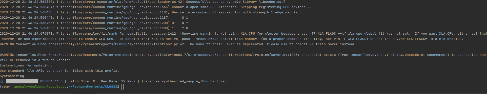

# One-shot Text to Speech: Voice-cloning with Linear Predictive Coding

Ziheng (Leo) Li, zl2990@columbia.edu

Dec 15th 2020

## Overview
This is a voice cloning system that relays on LPC features to 
synthesize in a previously unseen speaker's voice with just a few seconds of that speaker's voice available.
The system is consisted of a Speech Synthesizer, a speaker encoder and a vocoder.
We introduced using the LPC features as the intermediate speech representation. Transformation to LPC is performed on 
the speaker reference audio that is the input to the speaker encoder network. The synthesizer outputs the predicted LPC 
for the sentence to by synthesized. The vocoder takes the inferred LPC from the synthesizer and yield the final synthesized speech audio.
## Prerequisites
Run **prerequisites.sh** to install all the required packages. Note that our project used tensorflow V1, which maybe require
additional configuration steps in some cloud machines.

## Test the system
### Synthesize
Pretrained checkpoints is included in this project. As they are too large to put on GitHub. Please get both the synthesizer and the vocoder model from [here](https://drive.google.com/drive/folders/1ZZgMGTHUm3_QCVUlWdUnpjIcO2aSxC-R?usp=sharing).
Once you download saved_models, put it in ../CLOSSS/synthesizer/.. and ../CLOSSS/vocoder/.., respectively.

To test the system and synthesize
sentence in the voice of your choice, run **run.sh**. In run.sh, You can change the variable REFERENCE_AUDIO_PATH to your own speech
segment, and change the SENTENCE_TO_SYNTHESIZE to be a sentence ~20 words that you wish to synthesize. The synthesize process
should take less than 10 seconds. 
You should see the log as follows:

The output audio is saved to the root directory of the project as synthesized_sample_<REFERENCE_AUDIO_PATH>.wav 

### Similarity Results
To reproduce the similarity evaluation results found in the paper, run evaluation_similarity.py. Make sure to change the dataset_root variable
to where you saved the LibriSpeech dataset.
## Train the network
We have three network models that are trained separately. To train the model, invoke train.train() from each of the
encoder, synthesizer, and vocoder modules. The dataset used is the cleaned LibriSpeech.
